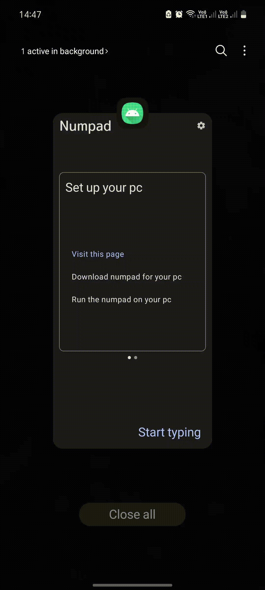

We have two apps:

+ the Numpad receiver is a PC Python app 
+ the Numpad sender is an Android app.

---
How this works:

+ Connect your PC to your mobile HotSpot.
+ Lunch the Numpad receiver on your PC. 
+ Lunch the Android Numpad app and enter the PC's address.
+ Press the connect button and start typing.

---

| | | | |
|--|--|--|--|
|  |  |  |  |
|  |  |  | 